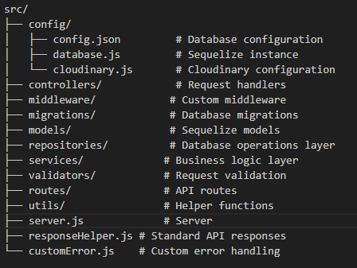
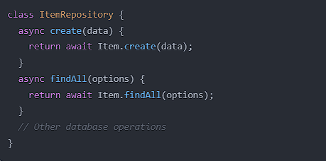
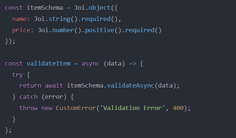
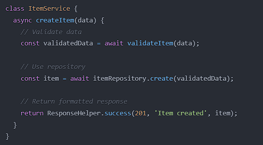
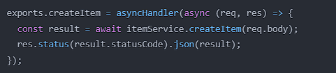
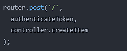

# Backend NodeJS/ExpressJS with PostgreSQL

Backend project using NodeJS/ExpressJS with PostgreSQL database implementing Repository Pattern and Clean Architecture.

## Project Structure:



## How to set up:

1. Launch `npm install`
2. Create `.env` file with following content:
   ```env
   NODE_ENV=development
   PORT=3000
   DB_HOST=localhost
   DB_USER=your_username
   DB_PASS=your_password
   DB_NAME=your_database
   JWT_SECRET=your_jwt_secret
   CLOUDINARY_CLOUD_NAME=your_cloud_name
   CLOUDINARY_API_KEY=your_api_key
   CLOUDINARY_API_SECRET=your_api_secret
3. Do configuration on database, this repo using postgresql
4. Launch npx sequelize-cli db:migrate (For Migration Table)
5. Launch npx sequelize-cli db:seed:all (For generate data dummy)

This is few command for create new table and create seeder:
1. Create table with one column: npx sequelize-cli model:generate --name Role --attributes role_name:string
2. Create table with multiple columns: npx sequelize-cli model:generate --name Product --attributes product_name:string,description:string,price:integer,category_id:integer
3. Create seeder: npx sequelize-cli seed:generate --name demo-category
4. Run specific seeder: npx sequelize-cli db:seed --seed <seeder file name>
5. Run all seeders: npx sequelize-cli db:seed:all

## How to create an Endpoint or API:

1. Create file in repositories folder:
  - Handle direct database operations
  - Implement basic CRUD operations
  - Return raw data from database
  - Example structure:
  - 

2. Create file in validators folder:
  - Define validation schemas
  - Implement validation rules
  - Handle validation errors
  - Example structure:
  - 

3. Create file in services folder:
  - Import repository and validator
  - Implement business logic
  - Handle data processing and validation
  - Return formatted responses
  - Example structure:
  - 

4. Create file in controllers folder:
  - Import service
  - Handle HTTP requests/responses
  - Use async handler for error handling
  - Example structure:
  - 

5. Create file in routes folder:
  - Define endpoints
  - Map to controller functions
  - Add middleware if needed
  - Example structure:
  - 

6. Register in server.js

## API Documentation:

### Authentication Endpoints:
- POST `/api/auth/register` - Register new user account
- POST `/api/auth/login` - Login user and get access token

### User Endpoints:
- GET `/api/users` - Get list of users (with pagination & search)
- GET `/api/users/:id` - Get specific user details
- POST `/api/users/create` - Create new user account
- PUT `/api/users/:id` - Update user information
- DELETE `/api/users/:id` - Delete user account

### Category Endpoints:
- POST `/api/categories` - Create new category
- GET `/api/categories` - Get all categories
- GET `/api/categories/:id` - Get category by ID
- PUT `/api/categories/:id` - Update category
- DELETE `/api/categories/:id` - Delete category

### Product Endpoints:
- POST `/api/products` - Create new product
- GET `/api/products` - Get all products (with filters & pagination)
- GET `/api/products/:id` - Get product by ID
- PUT `/api/products/:id` - Update product
- DELETE `/api/products/:id` - Delete product

### Role Endpoints:
- POST `/api/roles` - Create new role
- GET `/api/roles` - Get all roles
- GET `/api/roles/:id` - Get role by ID
- PUT `/api/roles/:id` - Update role
- DELETE `/api/roles/:id` - Delete role

## Standard Response Format:

### Success Response
\`\`\`json
{
  "statusCode": 200,
  "success": true,
  "message": "Success message",
  "data": {} // Optional data object
}
\`\`\`

### Error Response
\`\`\`json
{
  "statusCode": 400,
  "success": false,
  "message": "Error message",
  "error": "Error details" // Optional error details
}
\`\`\``

## 
The code structure now implements Repository, Validator, Service, Controller and Routes Pattern with clear layers:
  1. Repository: Responsible for direct database interaction
  2. Validator: Ensures data validity before processing
  3. Service: Handles business logic and orchestration
  4. Controller: Handles HTTP request/response
  5. Routes: Defines API endpoints


